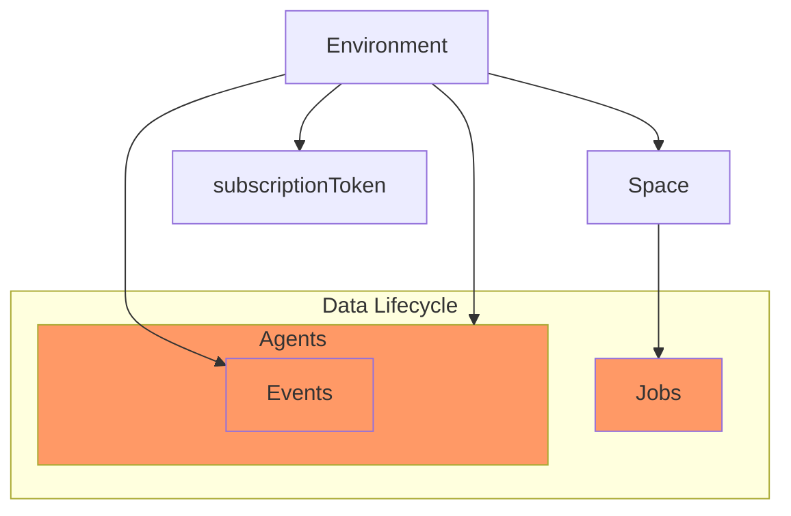

# Events, Agents & Jobs

## Events
An Event is a moment in time in a stream of events that happen in Flatfile.
**See [API Reference](../v10/eb50c4da09e65-list-events)**

**Event examples are things like:**
- Records created
- Job started
- Upload started, completed, failed

You can get a subscription token for a Space to notify you anytime an Event is generated or you can just use Agents. 

## Agents

An Agent is a “coordinator” that watches for events it cares about and then says “ok now perform this work”.

More about Agents here: [The Configurable World of X - Events, Agents, Jobs](https://docs.google.com/presentation/d/13D70DBWHDXnXNWPBaAr1yZJSOwTSUyBSU3gcFEtaDhQ/edit#slide=id.g20383d347f6_0_167)

**See [API Reference](../v10/b648e88c4f3c5-list-agents)**

## Jobs
A Job is a batch of work that you schedule to be completed asynchronously. Processing data asynchronously is necessary when the data is too big to wait around for the API to come back with a response.

**See [API Reference](../v10/0252a7beaa310-list-jobs)**

**There are 4 types of jobs:**
- Extracting data from a file (moving data from a file to a workbook)
- Mapping data from one workbook to another (moving data from a workbook to a workbook)
- Deleting data from a workbook (operate on data in a single workbook)
- Custom Jobs (new)

### Up next

[Deploying an Agent](Deploying.md)

