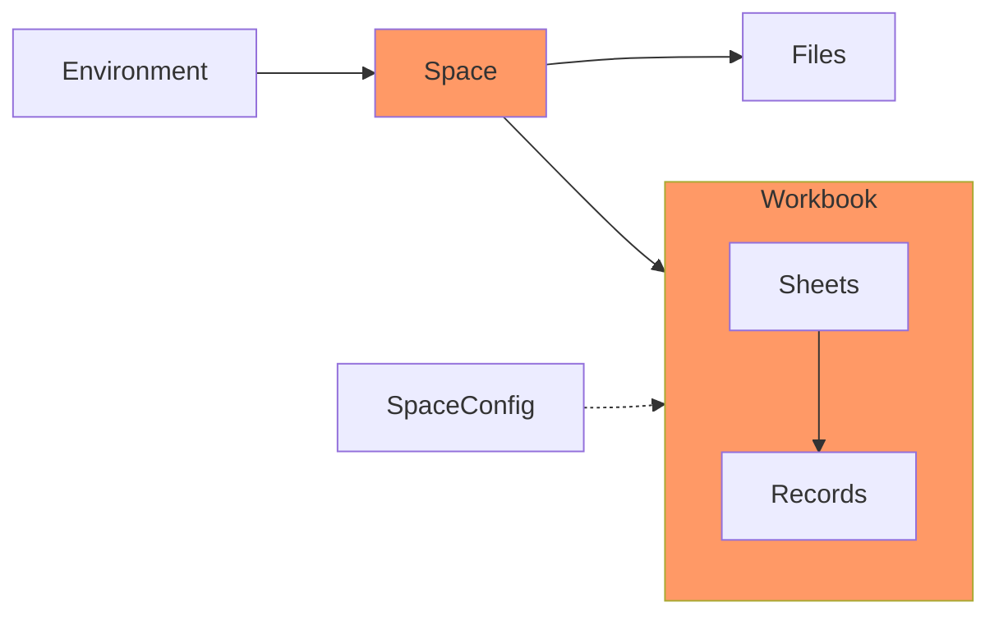

# Embed React

Embed React is a front-end SDK wrapper around the [Flatfile API](https://flatfile.stoplight.io/docs/v10/). It allows you to  securely and easily add an embedded import experience to any React app.

The [reference](#customize) below will cover complete customization details which includes adding your brand colors, logos, & fonts.

You can use embedded Flatfile to receive data via a self-serve experience. To find the additional Flatfile integration paths that may work better for your business, explore our [docs](flatfile.stoplight.io).

### Before you begin

The minimum supported version of React is v18. If you use an older version, upgrade React to use this library. You will also need Node.js v18 installed on your machine.

#### Concepts

Take a moment to learn the core Flatfile architecture. This will help orient yourself before you begin building.



**Environments** are isolated entities and are intended to be a safe space to create and test different configurations. (Common examples for Environment names are: Test, Staging, & Production.) For your new embedded data importer, you'll need to create a new Environment so anonymous guests can use your importer.

**Spaces** are where your customers come to experience Flatfile. When you launch an embedded importer, you're actually launching an entire Space for that Guest. You can configure (and often pare down) these Spaces to look exactly like you need them to for your use case. 

Within a Space, you can have one or more **Workbooks**.  Workbooks manage a data exchange experience for a specific type of data. Examples of Workbooks could be Employees, Contacts, or Accounts. 

When **Files** are uploaded, the data from those files is extracted into a Workbook.The Workbook is where the majority of the work and interaction occurs when using Flatfile.

The **Space Config** houses your Blueprint definitions. **Blueprints** are a beautiful, powerful schema definition syntax, designed specifically for data exchange specifications.

#### Setup

Install Embed React from the npm public registry.

```npm
npm install @flatfile/react@5.0.5
```
```yarn
yarn install @flatfile/react@5.0.5
```

#### 1. Generate an access token

From your [dashboard](https://dashboard.flatfile.com/), you can create a new API client ID and secret or reference the getting started page for one that was created for you already.

Make a `POST` request with the following and save your `accessToken` from the request response.

```json http
{
  "method": "post",
  "url": "https://api.x.flatfile.com/v1/auth/access-token",
  "body": {
    "clientId": "string",
    "secret": "string"
  }
}
```

#### 2. Create a new environment

Your first Environment was created for you when your Account was created but you'll need to create a new Environment passing `"shared_link"` as the value for `guestAuthentication`.

Make a POST request with the following and save your `id` from the request response.

```json http
{
  "method": "post",
  "url": "https://api.x.flatfile.com/v1/environments",
  "headers": {
    "Authorization": "Bearer <123 Paste Token here>"
  },
  "body": {
    "name": "dev",
    "isProd": false,
    "guestAuthentication": [
      "shared_link"
    ]
  }
}
```


## Build

### Space component

When you launch an embedded importer, you're actually launching an entire Space for that Guest.

There are two ways to create a Space component. The `useSpace` hook is the recommended way to access a mounted Space component because it will check for an error before you render the Space. You can also mount the Space component directly if you want more control. 

#### useSpace hook

The `useSpace` hook returns a Space component. If you need to access the Space object directly, mount it directly instead.

**Error handling**: If something internal to the Space component throws an error, we return it via **error** or the Space component if it builds correctly. This allows you to render your own error state.

```typescript
import { useState } from 'react'
import { useSpace } from '@flatfile/react'

const YourApplication = () => {
    const [showSpace, setShowSpace ] = useState(false)

    const mySpaceConfig = {
      slug: 'string'
      name: 'Hellerr',
      blueprints: Blueprint[] //see tab 2 for an example Blueprint
    }

    const { error, data: { component } } = useSpace({ 
      accessToken: 'access-token', 
      environmentId: 'environment-id', 
      spaceConfig: mySpaceConfig }
    )

      return (
        <div>

          <button
            onClick={() => {
              setShowSpace(!showSpace)
            }}
          >
            Toggle Space
          </button>
          
          {error && (<div>Sorry, there's been an error</div>)}
          
          {showSpace && component}

        </div>
      )
}
```
```Blueprint
{
  "slug": "persistent-slug",
  "name": "Blueprint name",
  "primary": false,
  "sheets": [
    {
      "name": "string",
      "description": "string",
      "slug": "string",
      "fields": [
        {
          "key": "name",
          "type": "string",
          "label": "Full Name",
          "description": "The full name of the customer",
          "constraints": [
            {
              "type": "required"
            }
          ]
        }
      ]
    }
  ]
}
```

#### Mount Space directly

Import the `Space` component directly into your client-side application.

```typescript
import Space from '@flatfile/react'

const Button = () => {
  return (
    <Space 
      accessToken= "access-token"
      environmentId= "environment-id"
      spaceConfig= mySpaceConfig
      >
    </Space>
  );
};

export default Button;
```

<br/>

| Prop            | Description                              |
| --------------- | ---------------------------------------- |
| `accessToken`   | `required` **string**<br/>Used to allow users to request our private services |
| `environmentId` | `required` **string**<br/>The base object that holds all spaces |
| `spaceId` | `required (if no spaceConfig or no spaceConfigId)` **string**<br/>Identifier for an existing space.<br/>Note: If you'd like to launch an existing space with a pre-existing config, pass in only your `spaceId`. |
| `spaceConfig` | `required (if no spaceId)` **Object**<br/>An object containing your Blueprint definitions<br/>Note: Pass in your raw `spaceConfig` if you want a brand new Space & spaceConfig on every launch. |
| `spaceConfigId` | `required (if no spaceConfig && no spaceId)` **string**<br/>Identifier for previously created spaceConfig<br/>Note: If you'd like to launch a new space with an exisiting spaceConfig, pass in only a `spaceConfigId` | 
| `themeConfig`   | `optional` **Object**<br/>An object containing theme configuration options. See available options. |
| `sidebarConfig` | `optional` **Object**<br/>An object containing sidebar configuration options. See available options. |
| `document` | `optional` **{ title: string, body: string}**<br/>Additional help text your user may need |

## Customize

### Theme

Since Embed React is mounted in an iframe, it will not inherit styling from your application. You can configure to match the design of your site with the `themeConfig` prop.

There are two ways to customize a Space component. The `makeTheme` helper function is the recommended way to customize because you can validate the colors passed in are valid. You can also add overrides manually if you want more control.

#### makeTheme helper function

The `makeTheme` helper function accepts three values (primaryColor, textColor, logo). From there, we programmatically create a nice looking theme for you. If you need more control, add raw values instead.

**Error handling**: Internally, our `makeTheme` helper validates that the colors passed in are valid colors. This means they can be correctly parsed. (Names, rgb, hsv, hex)

```typescript
const theme = makeTheme(
  { 
    primaryColor: 'red',
    textColor: 'white',
    logo: 'https://images.ctfassets.net/hjneo4qi4goj/gL6Blz3kTPdZXWknuIDVx/7bb7c73d93b111ed542d2ed426b42fd5/flatfile.svg'
  }
)
```
```useSpace title="Example passed to useSpace hook"
const { error, data: { component } } = 
  useSpace({ 
    themeConfig: theme, 
    accessToken, 
    environmentId,
    spaceConfig
  })
```
```Space title="Example passed to Space"
<Space 
  themeConfig={theme} 
  accessToken={accessToken} 
  environmentId={environmentId}
  spaceConfig={mySpaceConfig}
  {...props}
 />
```

<br/>

| Prop        | Description                              |
| ----------- | ---------------------------------------- |
| `primaryColor`   | `optional` **string** ['red']<br/>Primary brand color |
| `textColor` | `optional` **string** ['white']<br/>Text color |

#### Manual CSS overrides

Instead of passing two colors to `makeTheme` and letting us construct a theme for you, you can access each individual CSS variable that we use in the dashboard. Just adhere to the types defined in [IThemeConfig]('./src/types/IThemeConfig.tsx'). See [CSS Reference](Customize.md).


### Guest Sidebar

You can customize your guest sidebar using the [ISidebarConfig]('./src/types/ISidebarConfig.tsx') type or you can hide it completely (most common). Pass your sidebar configuration to your  `useSpace` hook or `Space` component.

```typescript
const mySidebarConfig = {
  showDataChecklist: false,
  defaultPage: {
    workbook: {
      workbookId: '123',
      sheetId: '123'
    }
  }
}
```
```useSpace title="Example passed to useSpace hook"
const { error, data: { component } } = 
  useSpace({ 
    sidebarConfig: mySidebarConfig, 
    accessToken, 
    environmentId  
  })

```
```Space title="Example passed to Space"
<Space 
  sidebarConfig={mySidebarConfig} 
  accessToken={accessToken} 
  environmentId={environmentId}
  spaceConfig={spaceConfig}
  {...props}
  />

const { error, data: { component }} = useSpace(
  { 
  sidebarConfig, 
  accessToken, 
  environmentId, 
  spaceConfig 
  }
)
```

<br/>

| prop                  | description |
| --------------------- | ------------   |
| `defaultPage > documentId`           |      `optional` **string** [null]<br/>Set the default Markdown page to show when the importer opens     |
| `defaultPage > workbook.workbookId` `defaultPage > workbook.sheetId`           |      `optional` **string** [null]<br/>Set the default Workbook and Sheet to show when the importer opens     |
| `showGuestInvite`       |      `optional` **boolean** [false]<br/>Allow your guests to invite others to the importer     |
| `showDataChecklist`     |      `optional` **boolean** [false]<br/>Show or hide the data checklist     |
| `showSidebar`           |      `optional` **boolean** [false]<br/>Show or hide the sidebar as a whole     |

#### Visual Reference


### Documents

Documents, written in Markdown, provide extra clarification and instructions to users of a Space. Each Document will appear in the sidebar of a Space. Standard syntax is supported.

```typescript
const mainDocument = {
  title: 'Getting Started',
  body:
      '\n' +
      '\\\n' +
      '&nbsp;\n' +
      '\n' +
      '---\n' +
      '\n' +
      '# Welcome to the Surf Shop!\n' +
      '\n' +
      'Please upload your contacts to the Surf Shop using the Files menu on the left.\n',
}
```
```useSpace title="Example passed to useSpace hook"
const { error, data: { component } } = 
  useSpace({
    spaceConfigId,
    sidebarConfig: mySidebarConfig, 
    accessToken, 
    environmentId,
    document: mainDocument
  })

```
```Space title="Example passed to Space"
<Space
  spaceConfigId={spaceConfigId}
  sidebarConfig={mySidebarConfig} 
  accessToken={accessToken} 
  environmentId={environmentId}
  document={mainDocument}
  {...props}
  />
```


