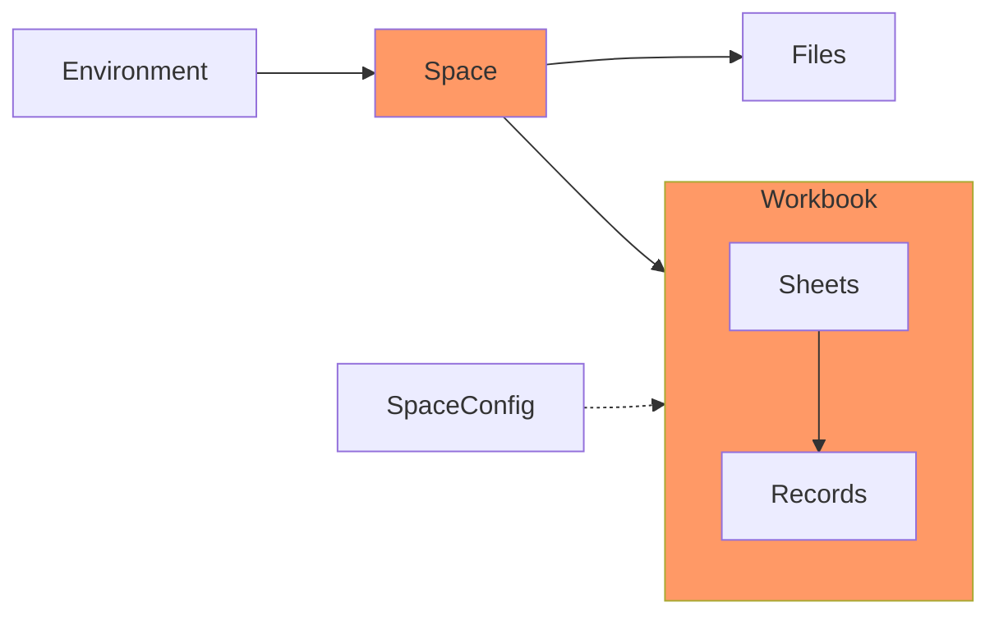

# Embed with Vanilla JS

We do not yet have an SDK for Vanilla JS. In the meantime, you can still add an embedded import experience.

The [reference](#customize) below will cover complete customization details which includes adding your brand colors, logos, & fonts.

You can use embedded Flatfile to receive data via a self-serve experience. To find the additional Flatfile integration paths that may work better for your business, explore our [docs](https://flatfile.stoplight.io).

### Before you begin

You will need Node.js v18 installed on your machine.

Check your versions in terminal:

```npm
node --version
```

#### Concepts

Take a moment to learn the core Flatfile architecture. This will help orient yourself before you begin building.



**Environments** are isolated entities and are intended to be a safe space to create and test different configurations. (Common examples for Environment names are: Test, Staging, & Production.) For your new embedded data importer, you'll need to create a new Environment so anonymous guests can use your importer.

**Spaces** are where your customers come to experience Flatfile. When you launch an embedded importer, you're actually launching an entire Space for that Guest. You can configure (and often pare down) these Spaces to look exactly like you need them to for your use case.

Within a Space, you can have one or more **Workbooks**. Workbooks manage a data exchange experience for a specific type of data. Examples of Workbooks could be Employees, Contacts, or Accounts.

When **Files** are uploaded, the data from those files is extracted into a Workbook.The Workbook is where the majority of the work and interaction occurs when using Flatfile.

The **Space Config** houses your Blueprint definitions. **Blueprints** are a beautiful, powerful schema definition syntax, designed specifically for data exchange specifications.

#### Setup

#### 1. Generate an access token

From your [dashboard](https://dashboard.flatfile.com/), you can create a new API client ID and secret or reference the getting started page for one that was created for you already.

Make a `POST` request with the following and save your `accessToken` from the request response (to use later in your [UseSpace hook](#usespace-hook)).

```json http
{
  "method": "post",
  "url": "https://api.x.flatfile.com/v1/auth/access-token",
  "body": {
    "clientId": "string",
    "secret": "string"
  }
}
```

#### 2. Create a new environment

Your first Environment was created for you when your Account was created but you'll need to create a new Environment passing `"shared_link"` as the value for `guestAuthentication`.

Make a POST request by pasting your real `accessToken` with `${accessToken}` and save your `id` (`environmentId`) from the request response (to use later).

```json http
{
  "method": "post",
  "url": "https://api.x.flatfile.com/v1/environments",
  "headers": {
    "Authorization": "Bearer ${accessToken}"
  },
  "body": {
    "name": "dev",
    "isProd": false,
    "guestAuthentication": ["shared_link"]
  }
}
```

From your Flatfile dashboard, notice that you now have a new Environment in the dropdown on the bottom left. After refreshing the page, the "name" you specified in your API call will show up as a new option. Toggle to this Environment as this is where you'll be deploying.

## Build

### Space Config component

When you launch an embedded importer, you're actually launching an entire Space for that Guest.

#### 1. Create a new SpaceConfig

Configure your Space with how you want your Workbook to look via a SpaceConfig. Note that a primary action will show up in the Workbook in the top right and can be considered your final action.

Make a POST request by pasting your real `accessToken` with `${accessToken}`and save your `id` (`spaceConfigId`) from the request response (to use later).

```json http
{
  "method": "post",
  "url": "https://api.x.flatfile.com/v1/spaces/configs",
  "headers": {
    "Authorization": "Bearer ${accessToken}"
  },
  "body": {
    "slug": "persistent-slug",
    "name": "Editable Name",
    "blueprints": [
      {
        "slug": "persistent-slug",
        "name": "Blueprint name",
        "primary": false,
        "sheets": [
          {
            "name": "string",
            "description": "string",
            "slug": "string",
            "access": ["*"],
            "fields": [
              {
                "key": "name",
                "type": "string",
                "label": "Full Name",
                "description": "The full name of the customer",
                "constraints": [
                  {
                    "type": "required"
                  }
                ],
                "readonly": true
              },
              {
                "key": "name",
                "type": "string",
                "label": "First Name",
                "description": "The first name of the customer",
                "constraints": [
                  {
                    "type": "required"
                  }
                ],
                "readonly": false
              },
              {
                "key": "name",
                "type": "string",
                "label": "Last Name",
                "description": "The last name of the customer",
                "constraints": [
                  {
                    "type": "required"
                  }
                ],
                "readonly": false
              }
            ],
            "actions": [
              {
                "slug": "submit",
                "label": "Submit",
                "type": "string",
                "description": "Submit your data",
                "primary": true
              }
            ]
          }
        ]
      }
    ]
  }
}
```

#### 2. Create a Space

To create a Space, make a POST request by pasting your real `accessToken` with `${accessToken}` and save your `id` (`spaceConfigId`) from the request response (to use later).

```json http
{
  "method": "post",
  "url": "https://api.x.flatfile.com/v1/spaces",
  "headers": {
    "Authorization": "Bearer ${accessToken}"
  },
  "body": {
    "spaceConfigId": "${spaceConfigId}",
    "environmentId": "${environmentId}",
    "name": "My Space",
    "displayOrder": 1,
    "guestAuthentication": ["shared_link"]
  }
}
```

#### 3. Embed into your app

Login to your dashboard and click on the Space you just created. Head to the page you want your customers to see first. Note the URL.

```js
<iframe
  src="https://spaces.flatfile.com/space/s_sp_{$spaceId}/workbook/us_wb_{$workbookId}/sheet/us_sh_{$sheetId}"
  style="min-height: 750px; width: 100%; border: none; margin: 16px"
></iframe>
```

## Customize

### Theme

Since your code is mounted in an iframe, it will not inherit styling from your application. You can configure to match the design of your site with the `useThemeGenerator` hook.

There are two ways to customize. The `useThemeGenerator` helper function is the recommended way to customize because you can validate the colors passed in are valid. You can also add overrides manually if you want more control. See [CSS Reference](Customize.md).

#### Manual CSS overrides

Instead of passing two colors to `useThemeGenerator` and letting us construct a theme for you, you can access each individual CSS variable that we use in the dashboard. See [CSS Reference](Customize.md).

### Guest Sidebar

You can customize your guest sidebar or you can hide it completely (most common). See [CSS Reference](Customize.md).

### Documents

Documents, written in Markdown, provide extra clarification and instructions to users of a Space. Each Document will appear in the sidebar of a Space. Standard syntax is supported.

To create a Document, make a POST request by pasting your real `accessToken` with `${accessToken}` and your `${spaceId}` from the request response (to use later).

```json http
{
  "method": "post",
  "url": "https://api.x.flatfile.com/v1/spaces",
  "headers": {
    "Authorization": "Bearer ${accessToken}"
    "spaceId": "${spaceId}"
  },
  "body": {
  "title": "Getting Started",
  "body": "This is a markdown body"
  }
}
```
