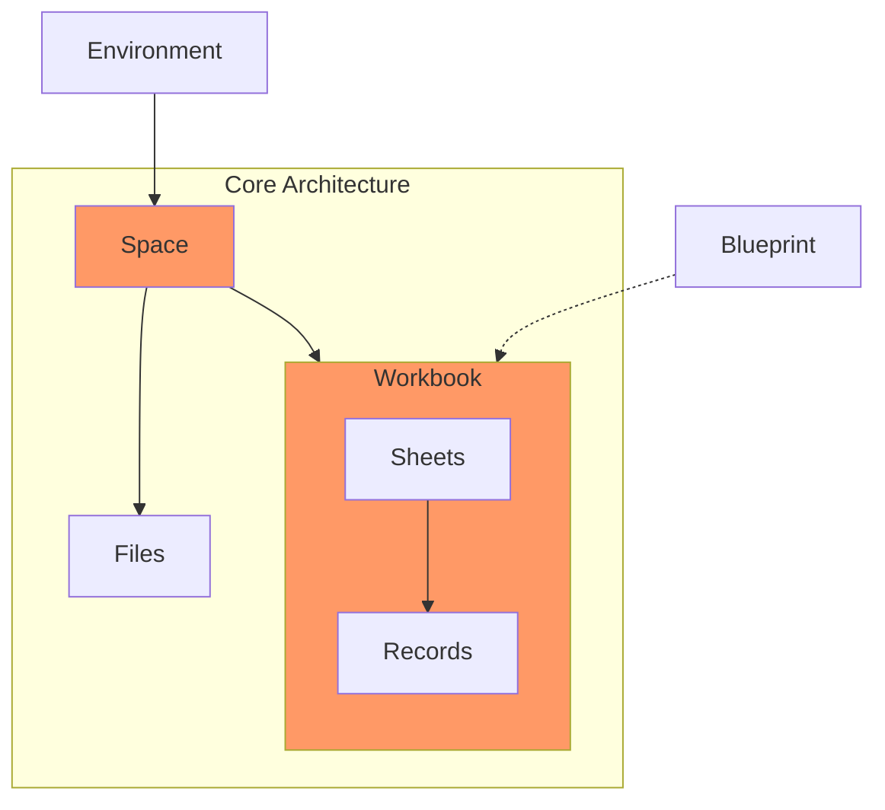

# Spaces & Workbooks

## Spaces

Spaces are where you collaborate with others on Data Exchange. Your customers come to experience Flatfile in a Space. 

**See [API Reference](../v10/b747858855192-list-spaces)**

A Space has both an [Environment](/docs/v10/docs/Auth.md#environments) and a Space Config. The Environment specifies where this Space operates (e.g. Dev, Staging, Prod), and the Space Config defines what the Space is and does.

Files, [Jobs](Agents.md), and [Guests](/docs/v10/docs/Auth.md#users--guests) are added to a Space as your users interact with Flatfile.

**Things you can do in a Space:**
- Add Workbooks
- Invite others
- Edit each others’ Workbooks, download them

## Workbooks

Workbooks are the smartest self healing database in the world. Files are uploaded into Workbooks, then the data from those files are extracted into a Workbook.

**See [API Reference](../v10/90de10e6918cb-list-workbooks)**

### Using a Workbook

Each Workbook has an associated Space Configuration that is used when creating a new Space. You can think of the Space Configuration as the link between an individual Space and the Workbook templates you’ve configured.

Once you have deployed your space config and Workbook, you can create the Space in one of the following ways:
1. Using the [POST /spaces endpoint](../v10/25e20c8ab61c5-create-a-space)
2. Using the  spaceConfigId  and  environmentId  returned when deploying your Workbook/Sheet Config
3. Or by using the “Create New Space” button in the “Spaces” tab in the Dashboard. 

Here’s a very quick example of what a deploy looks like: 
https://www.loom.com/share/f2299b28e27e48a4b719ec005f55caae 

### Up Next

[Deploying a Workbook](Deploying.md)

