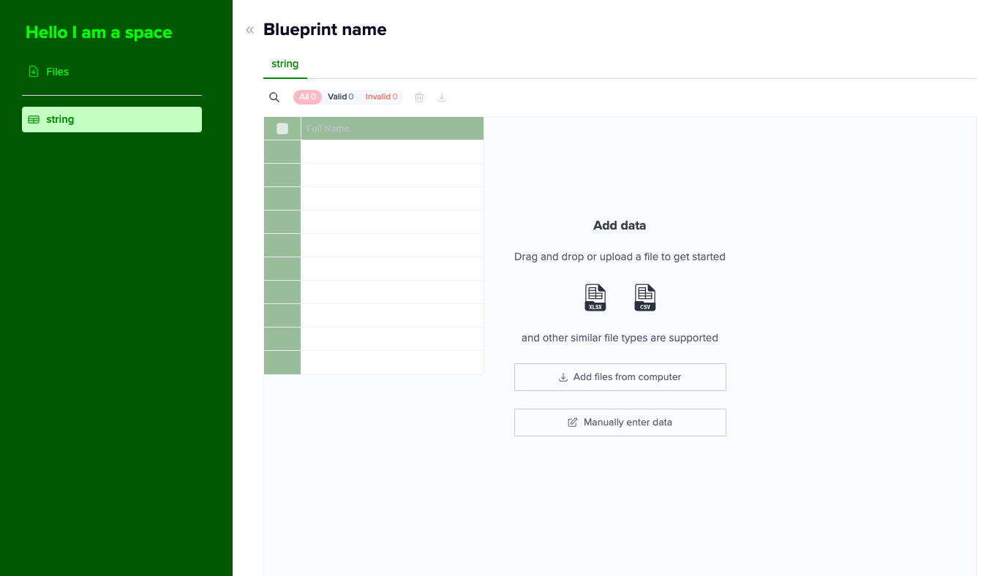
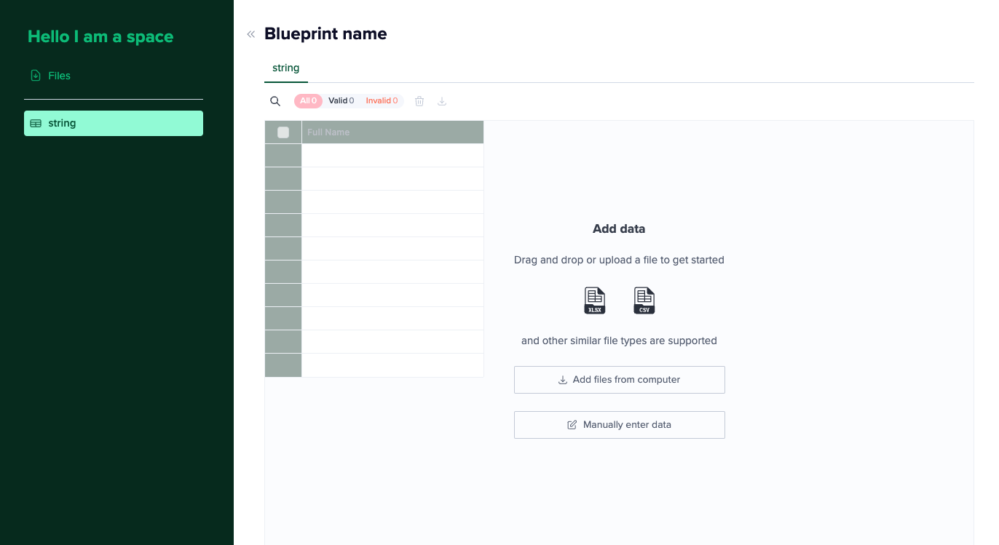

## Theme Config

Why go bland when you can go ✨ _bright_ ✨ ?

Our Space component accepts a `themeConfig` prop that allows you to customize your Space theme almost anyway you can imagine it.
<br>There are two ways you can create this config.

1. Using our `useThemeGenerator` hook
2. Raw values aka writing your config from scratch

### `useThemeGenerator` hook

This hook accepts two color values; primary and action. **Primary is the only required value.** Internally, our hook validates that the colors passed in are valid colors. This means they can be correctly parsed. (Names, rgb, hsv, hex)

```

We lighten / darken a few of the colors to create a nice looking theme for you. If you'd like to customize further, see raw values section below.

**Some examples**

const theme = useThemeGenerator({ primary: '#023020', action: '#FFC0CB' })



const theme = useThemeGenerator({ primary: 'forestGreen', action: 'pink' })




// pass to <Space /> component or useSpace hook

<Space themeConfig={theme} token={token} envId={envId } {...props} />

const { error, data: { component } } = useSpace({ themeConfig: theme, token, envId  })

```

### Raw values

Instead of passing two colors to usethemeGenerator and letting us construct a theme for you, you can access each individual CSS variable that we use in the dashboard. Just adhere to the types defined in [IThemeConfig]('./src/types/IThemeConfig.tsx').

**Here's an example of all customizable attributes**

```
{
  "theme": {
    "root": {
        "primaryColor": "#005443",
        "dangerColor": "#FF0000",
        "warningColor": "#6E8702"
    },
    "sidebar": {
        "logo": "https://images.ctfassets.net/hjneo4qi4goj/2gtPq9zii8Qs2bxcSUEFin/859ef0552d61a898ea11fe6970cc50cd/Screenshot_2023-02-23_at_11.09.23_AM.png?h=250",
        "textColor": "pink",
        "titleColor": "purple",
        "focusBgColor": "aqua",
        "focusTextColor": "orange",
        "backgroundColor": "yellow",
        "footerTextColor": "white",
        "textUltralightColor": "blue"
    },
    "table": {
        "inputs": {
            "radio": {
                "color": "blue"
                }
            "checkbox": {
                "color": "blue"
            }
        },
        "filters": {
            "color": "yellow"
                "active": {
                    "backgroundColor": "purple"
                }
            "error": {
                "activeBackgroundColor": "aqua"
            }
        },
        "column": {
            "header": {
                "fontSize": "16px",
                "backgroundColor": "green",
                "color": "blue",
                "dragHandle": {
                    "idle": "yellow",
                    "dragging": "blue"
                }
            }
        },
        "fontFamily": "cursive",
        "indexColumn": {
                backgroundColor: "gray"
                selected: {
                    color: "gray"
                    backgroundColor: "gray"
            }
        },
        "cell": {
            "selected": {
                "backgroundColor": "gray"
            }
            "active": {
                "borderColor": "gray"
                "spinnerColor": "gray"
            }
        },
        "boolean": {
            "toggleChecked": "gray"
        },
        "loading": {
            "color": "gray"
        }
    }
  }
}

```

## Sidebar Config

We offer the ability to customize your sidebar as well using the [ISidebarConfig]('./src/types/ISidebarConfig.tsx') type and passing it to your `<Space />` component or `useSpace` hook.

| Flag                  | Default values |
| --------------------- | :------------: |
| showPoweredByFlatfile |      true      |
| showGuestInvite       |     false      |
| showDataChecklist     |     false      |
| showSidebar           |     false      |

```ts
const mySidebarConfig = {
  showPoweredByFlatfile: false
}

<Space sidebarConfig={mySidebarConfig} token={token} envId={envId} />

const { error, data: { component }} = useSpace({ sidebarConfig, token, envId })
```
